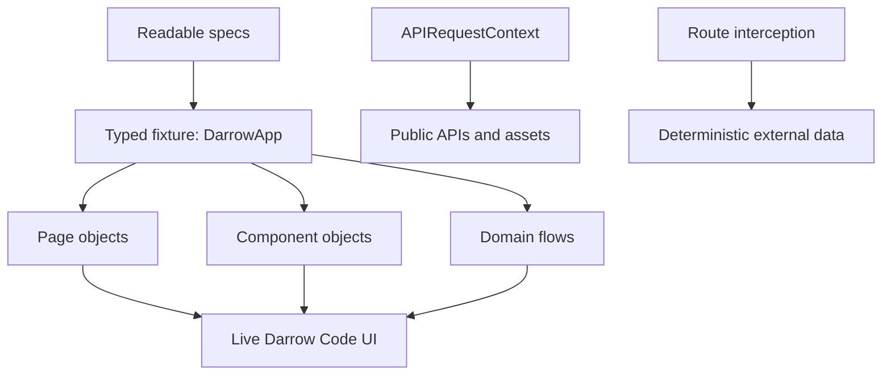

# Darrow Code Playwright Automation

[](https://github.com/dmytropogribnyy/darrow-code-playwright-automation/actions/workflows/quality.yml)
[](https://github.com/dmytropogribnyy/darrow-code-playwright-automation/actions/workflows/nightly.yml)

**Playwright + TypeScript quality engineering for a live AI-powered web product.**

[Live product](https://darrowcode.com/) ·
[Product engineering showcase](https://github.com/dmytropogribnyy/darrow-code-insight) ·
[Test strategy](docs/test-strategy.md)

This repository is a public, production-style automation work sample for Darrow Code. It exercises
the real deployed product with a deliberately safe test boundary: public UI, public APIs, public
sample PDFs, deterministic third-party integration checks, and the customer journey up to—but not
through—data submission or checkout.

> Independent quality-engineering implementation for a live product. The production source,
> customer data, credentials, prompts, payment configuration, and operational tooling remain
> private.

## What this demonstrates

| Capability                   | Evidence in this repository                                                               |
| ---------------------------- | ----------------------------------------------------------------------------------------- |
| Playwright Test + TypeScript | Strict TypeScript, typed fixtures, projects, web-first assertions                         |
| Page Object Model            | `HomePage` plus reusable `SiteHeader` and `IntakeDialog` component objects                |
| Domain flow                  | `CoreIntakeFlow` expresses the customer journey without leaking selectors into tests      |
| UI smoke                     | Storefront and Daily Horoscope navigation on Chromium, Firefox, and WebKit                |
| End-to-end                   | Real CORE selection and intake opening, stopped before customer data or checkout          |
| API testing                  | `APIRequestContext` validates build, sitemap, and PDF contracts                           |
| Integration testing          | NOAA Kp response intercepted and fulfilled deterministically with `page.route()`          |
| Mobile                       | Pixel 7 project with responsive visibility and horizontal-overflow guard                  |
| Accessibility                | axe-core WCAG A/AA scan of the principal page content                                     |
| CI/CD                        | Fast pull-request gate, scheduled full suite, traces, screenshots, videos, HTML and JUnit |

## Architecture



The structure stays intentionally small. Page and component objects own locators and reusable UI
behavior; domain flows compose business journeys; test files retain the assertions that explain
the intended outcome.

## Test suites

```text
tests/
├── api/             public API and static-asset contracts
├── ui/              cross-browser critical-path smoke
├── integration/     deterministic external-service behavior
├── e2e/             safe live customer journey
├── accessibility/   automated WCAG checks
└── mobile/          representative handset coverage
```

The [test strategy](docs/test-strategy.md) defines coverage, selector policy, CI gates, and the
production safety boundary.

## Quick start

Requirements: Node.js 24+.

```bash
npm ci
npx playwright install --with-deps chromium
npm run quality
npm run test:api
npm run test:smoke
```

Run the full local matrix after installing all browser engines:

```bash
npx playwright install --with-deps chromium firefox webkit
npm test
```

Use a different explicitly approved environment:

```bash
BASE_URL=https://approved-test-environment.example npm test
```

## Useful commands

| Command                      | Purpose                                           |
| ---------------------------- | ------------------------------------------------- |
| `npm run quality`            | Typecheck, lint, and verify formatting            |
| `npm run test:api`           | Public API and asset contracts                    |
| `npm run test:smoke`         | Fast Chromium release smoke                       |
| `npm run test:cross-browser` | Critical path on Chromium, Firefox, and WebKit    |
| `npm run test:e2e`           | CORE customer journey to the safe intake boundary |
| `npm run test:integration`   | Deterministic external-service integration        |
| `npm run test:a11y`          | axe-core accessibility scan                       |
| `npm run test:mobile`        | Pixel 7 responsive checks                         |
| `npm run report`             | Open the generated HTML report                    |

## Reliability choices

- User-facing roles, names, and labels instead of DOM structure or XPath.
- Playwright auto-waiting and retrying assertions instead of fixed delays.
- A fresh browser context and independent state for every test.
- Deterministic network fulfillment for the NOAA integration.
- Separate API, desktop, cross-browser, and mobile projects to avoid redundant execution.
- Retries only in CI and only to collect trace evidence; a flaky first attempt remains visible.
- TypeScript compilation runs separately because Playwright's transform does not typecheck tests.

## Production safety

No test submits personal data, creates a Stripe session, purchases a report, calls a paid AI
provider, triggers email/PDF delivery, or accesses protected customer/admin routes. See the
[full boundary](docs/test-strategy.md#production-safety-boundary).

## Positioning

This is a transparent technical work sample built against a real independently developed product.
It is not presented as a fabricated third-party client engagement.

## License

[MIT](LICENSE)
